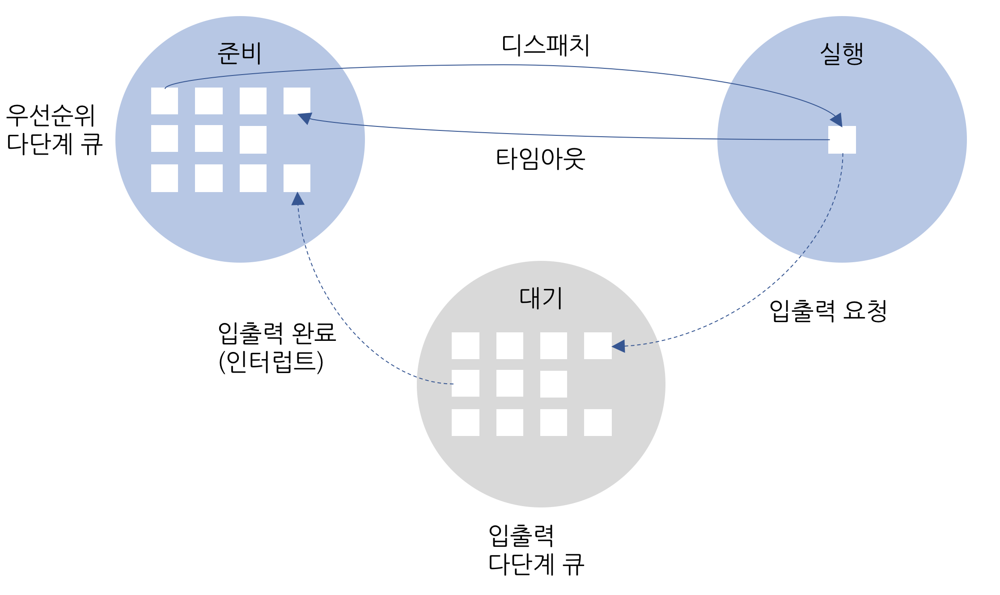

# 01 스케줄링의 개요

## 1. 식당 관리자의 스케줄링

- 식당 관리자의 역할 (CPU 스케줄러, 프로세서 스케줄러 processor scheduler ):

    - 예약관리 : 자리 비워두기 / 약속 시간 지나면 연락 혹은 다른 손님 자리배정
    - 좌석관리 : 도착한 순서대로 테이블 안내 / 주문 / 대기표
    - 주문관리 : 주문서 주방에
    - 조리 순서 관리 : 손님의 온 순서, 예약, 식사진행에 따라 조리 순서변경 가능
    - 손님 요청 관리 : 개별적 손님의 요구

## 2.스케줄링의 단계

- 식당관리자의 일

    - 좌석관리 : 상황을 파악하여 적당한 인원 자리 배정
    - 조리순서관리 : 손님의 상황을 고려하여 요리 나가는 순서와 속도 관리

### 2.1 고수준 스케줄링 High level scheduling

* 정의
  - 가장 큰 틀에서 이루어지는 CPU 스케줄링(장기 long-term 스케줄링, 작업 job 스케줄링, 승인 admission 스케줄링)
  - 시스템 내의 전체 작업(프로세스 : 운영체제에서 다루는 일의 가장 큰 단위) 수를 조절하는 것

* 역할
  - 어떤 작업을 시스템이 받아들일지 거부할지 결정
  - 시스템 내에서 동시에 실행 가능한 프로세스의 총 개수가 정해짐

* 비유
  - (전체 손님 수 조절)

### 2.2 저수준 스케줄링 Low level Scheduling

* 정의
  - 가장 작은 단위의 아주 짧은 시간에 일어나는 스케줄링(단기 short-term 스케줄링)

* 역할
  - 어떤 프로세스에 CPU를 할당할지 / 어떤 프로세스를 대기 상태로 보낼지 결정
  - 준비 -> 실행 / 실행 -> 대기 / 대기 -> 준비

* 비유
  - (각 손님의 주문과 그에 따른 요리 제공 순서 조절)

### 2.3 중간 수준 스케줄링 Middle level Scheduling

* 정의
  - 고수준 스케줄링과 저수준 스케줄링 사이에 일어나는 스케줄링

* 역할
  - 프로세스 활성화 후 시스템 과부하가 발생했을 때 일어남
  - 중지 suspend 와 활성화 active 로 전체 시스템의 활성화된 프로세스 수를 조절하여 과부하 방지
  - 일부 프로세스를 중지 상태로 옮김(보류)
  - 저수준 스케줄링이 잘 이루어지도록 완충 buffer 역할

* 비유
  - (판단에 따라 좌석 수 결정 후 손님 but 모든 손님이 조리시간이 긴 코스요리 주문시 -> 메뉴 변경 / 주문 천천히)

### 2.4 스케줄링의 단계 정리

* 고수준
    - 전체 시스템의 부하를 고려하여 작업 시작 or 거부
    - 전체 프로세스 수 결정 -> 멀티프로그래밍 정도 degree of multiprogramming
    - 큰 시스템에서 규모가 큰 일괄 작업 시 사용  (예 :메임프레임)

* 중간 수준
    - 시스템 부하 조절
    - 시스템 과부하가 걸리면 이미 활성화된 프로세스중 일부를 보류 상태로 보냄
    - 처리 능력 여유가 생길시 보류된 프로세스 다시 활성화

* 저수준
    - CPU 스케줄러라고 하면 보통 저수준 스케줄러를 의미
    - 실제 작업이 이루어짐
    - 준비 -> 실행 / 대기 / 타임 아웃

- 대부분 CPU 스케줄러 : 중간수준 스케줄링 + 저수준 스케줄링

## 3.스케줄링의 목적

* 공평성 : 모든 프로세스가 자원을 공평하게 배정 받아야 하고 자원 배정 과정에서 특정 프로세스가 배제되어서는 안 된다.
* 효율성 : 시스템 자원이 유휴 시간 없이 사용되도록 스케줄링을 하고, 유휴 자원을 사용하려는 프로세스에는 우선권을 주어야 한다.
* 안정성 : 우선순위를 사용하여 중요 프로세스가 먼저 작동하도록 배정함으로써 시스템 자원을 점유하거나 파괴하려는 프로세스로부터 자원을 보호해야 한다.
* 확장성 : 프로세스가 증가해도 시스템이 안정적으로 작동하도록 조치해야 한다. 시스템 자원이 늘어나는 경우 이 혜택이 시스템에 반영되게 해야 한다.
* 반응 시간 보장 : 응답이 없는 경우 사용자는 시스템이 멈춘 것으로 가정하기 때문에 시스템은 적절한 시간 안에 프로세스의 요구에 반응해야 한다.
* 무한 연기 방지 : 특정 프로세스의 작업이 무한히 연기 되어서는 안 된다.

# 02 스케줄링 시 고려 사항

## 1. 선점형 스케줄링과 비선점형 스케줄링

* 선점형 preemptive 스케줄링
    - 어떤 프로세스가 CPU를 할당받아 실행 중이더라도 운영체제가 CPU를 강제로 빼앗을 수 있는 스케줄링 방식
    - 인터럽트 처리기 : CPU가 인터럽트를 받으면 현재 실행 중인 작업을 중단하고 커널을 깨워서 인터럽트 처리하고 완료되면 원래 작업으로 돌아감.
    - 단점 : 문맥 교환 같은 부가적인 작업으로 낭비가 생김
    - 대화형 시스템 / 시분할 시스템 : 빠른 응답 시간을 요구하는 시스템 적합
    - 대부분 저수준 스케줄러는 선점형 스케줄링 사용

* 비선점형 non-preemptive 스케줄링
    - 어떤 프로세스가 CPU를 점유하면 다른 프로세스가 이를 빼앗을 수 없는 스케줄링 방식
    - 작업량이 적고 문맥 교환에 의한 낭비도 적음
    - 전체 시스템의 처리율이 떨어짐(CPU 사용 시간이 긴 프로세스 때문에 사용 시간 짧은 프로세스가 오래 기다림)
    - 일괄 작업 시스템에서 사용하던 방식

- 선점형 스케줄링과 비선점형 스케줄링 비교

| 구분 | 선점형 | 비선점형 |
| --- | --- | --- |
| 작업 방식 | 실행 상태에 있는 작업을 중단시키고 새로운 작업 실행가능 | 실행 상태에 있는 작업이 완료 될때까지 다른 작업 실행이 불가능 |
| 장점 | 프로세스가 CPU를 독점할 수 없어 대화형이나 시분할 시스템에 적합 | CPU 스케줄러의 작업량이 적고 문맥 교환의 오버헤드가 적음 |
| 단점 | 문맥 교환의 오버헤드가 많음 | 기다리는 프로세스가 많아 시스템 처리율이 떨어짐 |
| 사용 | 시분할 방식 스케줄러에 사용 | 일괄 작업 방식 스케줄러에 사용 |
| 중요도 | 높음 | 낮음 |

## 2. 프로세스 우선순위

- 프로세스 우선순위가 없다 = 중요도가 같다 = 순차적 실행

- 일반 프로세스의 우선순위는 사용자가 조절할 수 있음

- 우선순위 : 일반 프로세스 < 커널 프로세스

## 3. CPU 집중 프로세스와 입출력 집중 프로세스

  - 생성 -> 실행 (CPU 버스트)<->(입출력 버스트) 대기 -> 완료

- 입출력 집중 프로세스 I/O bound process : 저장장치에서 데이터를 복사하는 일과 같이 입출력을 많이 사용하는 프로세스 / 입출력 버스트가 많은 프로세스

- 사이클 훔치기 cycle stealing : 입출력 집중 프로세스가 CPU 집중 프로세스보다 실행 상태에 먼저 들어가는 경우

- 우선순위 : CPU 집중 프로세스 < 입출력 집중 프로세스

## 4. 전면 프로세스와 후면 프로세스

- 전면 프로세스 : GUI를 사용하는 운영체제에서 화면이 맨 앞에 놓인 프로세스 / 현재 입력과 출력을 사용하는 프로세스 / 상호작용프로세스(사용자와 상호작용이 가능)
- 후면 프로세스 : 사용자와 상호작용이 없는 프로세스

- 우선순위 : 후면 프로세스 < 전면 프로세스

## 5. 정리

| 우선순위 낮음 | 우선순위 높음 | 구분|
| --- | --- |--- |
|일괄 처리 프로세스(비선점형)| 대화형 프로세스(선점형) | X|
|일반 프로세스 | 커널 프로세스 |O|
|CPU 집중 프로세스 | 입출력 집중 프로세스|X|
|후면 프로세스 | 전면 프로세스 |O|

# 03 다중 큐

## 1. 준비 상태의 다중 큐

- 프로세스는 준비 상태에 들어올 때마다 자신의 우선순위에 해당하는 큐의 마지막tail에 삽입
- 한번에 하나의 프로세스를 꺼내 CPU에 할당

 - 고정 우선순위 방식 : 우선 순위를 부여하면 프로세스가 끝날 때까지 바뀌지 않는 방식
    - 구현하기 쉬움
    - 작업 효율이 떨어짐

 - 변동 우선순위 방식 : 프로세스 생성 시 부여받은 우선순위가 작업 중간에 변하는 방식
    - 구현 어려움
    - 시스템 효율성 높임

## 2. 대기 상태의 다중 큐

- 대기 상태에서 같은 입출력을 요구한 프로세스끼리 모아놓음.
- 여러 개의 프로세스 제어 블록을 동시에 꺼내 준비 상태로 옮김

# 04 스케줄링 알고리즘

| 구분 | 종류|
| --- | --- |
| 비선점형 알고리즘	| FCFS, SJF, HRN |
|선점형 알고리즘	| 라운드로빈, SRT, 다단계 큐, 다단계 피드백 큐 |
| 둘 다 가능 | 우선순위 알고리즘 |

## 1. 스케줄링 알고리즘의 선택 기준

## 2. FCFS 스케줄링 First Come First Served

- 선입선출 스케줄링 (FIFOFirst In First Out 이라고도 하는데 FIFO는 큐를 가리키는 말)
- 준비 큐에 도착한 순서대로 CPU를 할당하는 비선점형 방식
- 큐가 하나이므로 모든 프로세스의 우선순위가 동일
- 입출력 작업을 요청하는 경우 CPU가 쉬는시간이 많아져 비효율적.

### 2.1 FCFS 스케줄링의 동작 방식

### 2.2 FCFS 스케줄링의 성능

### 2.3 FCFS 스케줄링의 평가

## 3. SJF 스케줄링 Shortest Job First

- 실행시간이 가장 짧은 작업부터 CPU를 할당하는 비선점형 방식

- 실행시간이 짧은 것만 실행하다보면 가장 긴 실행시간을 가진 작업은 뒤로 밀린다. 이를 아사현상(starvation)이라고 한다

- 아사현상(starvation) : 작업이 계속연기되는 경우

- 에이징 : 프로세스가 양보할 수 있는 상한선을 정하는 방식
ex) 순서를 양보할 때 마다 나이를 1살씩 먹어 세 살먹으면 무조건 실행

- 종료시간을 파악하기 어렵고 아사현상이 일어나기 쉬움 (잘 사용 X)

### 3.1 SJF 스케줄링의 동작 방식

### 3.2 SJF 스케줄링의 성능

### 3.3 SJF 스케줄링의 평가

## 4. HRN 스케줄링Highest Response Ratio Next

- 우선순위 = (대기 시간 + CPU사용시간) / CPU사용시간

- 시간이 짧은 프로세스의 우선순위 높게 / 대기 시간 고려 -> 아사현상 완화 but  공평성 위배

### 4.1 HRN 스케줄링의 동작 방식

### 4.2 HRN 스케줄링의 평가

## 5. 라운드 로빈 스케줄링

- 순환 순서 방식

- 타임 슬라이스 : 작업이 실행되는 일정 시간.
- 타임 슬라이스 동안만 작업할 수 있으며, 작업이 다 끝나지 않으면 큐의 뒤쪽에 다시 삽입.
- 우선순위 적용 X

- 타임슬라이스의 크기와 문맥교환
- 타임슬라이스가 큰 경우 : 반응 속도가 매우느림.
- 타임슬라이스가 작은 경우 : 문맥교환에 많은 시간을 낭비하여 실제 작업 X

### 5.1 라운드 로빈 스케줄링의 동작 방식

### 5.2 라운드 로빈 스케줄링의 성능

### 5.3 타임 슬라이스의 크기와 문맥 교환

## 6. SRT 스케줄링Shortest Remaining Time

- SJF + 라운드 로빈 혼합 (SJF 스케줄링의 선점형 버전)

- CPU를 할당받을 프로세스를 선택 할 때 남아 있는 작업 시간이 가장 적은 프로세스를 선택

- 남은시간을 주기적으로 계산하고 문맥교환을 해야하므로 작업이 더 증가

### 6.1 SRT 스케줄링의 동작 방식

### 6.2 SRT 스케줄링의 성능

### 6.3 SRT 스케줄링의 평가

## 7. 우선순위 스케줄링

- 우선순위를 어떤 기준으로 정하느냐에 따라 다양하게 구현가능

- 비선점형 방식

### 7.1 우선순위 스케줄링의 동작 방식

### 7.2 우선순위 스케줄링의 평가

## 8. 다단계 큐 스케줄링Multilevel Queue

-라운드로빈 방식으로 운영되는 큐

- 우선순위에 따라 해당 우선순위의 큐에 삽입된다.

- 우선순위가 높은 상위 큐 프로세스 작업이 끝나야 하위 큐 프로세스 작업 수행 가능

## 9. 다단계 피드백 큐 스케줄링

- CPU를 사용하고 난 프로세스의 우선순위가 낮아지고 CPU를 사용하고 난 프로세스는 우선순위가 하나 낮은 큐의 끝으로 들어감

- 우선순위에 따라 타임 슬라이스의 크기가 다르다. 어렵게 얻은 CPU를 좀 더 오랫동안 사용할 수 있도록 우선순위가 낮은 큐의 타임슬라이스를 크게 설정

# 05 인터럽트 처리

## 1. 인터럽트의 개념

## 2. 동기적 인터럽트와 비동기적 인터럽트

- 동기적 인터럽트synchronous interrupt : 실행 중인 명령어로 인해 발생
- 비동기적 인터럽트asynchronous interrupt : 실행 중인 명령어와 무관하게 발생

## 3. 인터럽트 처리 과정

## 4. 인터럽트와 이중 모드
